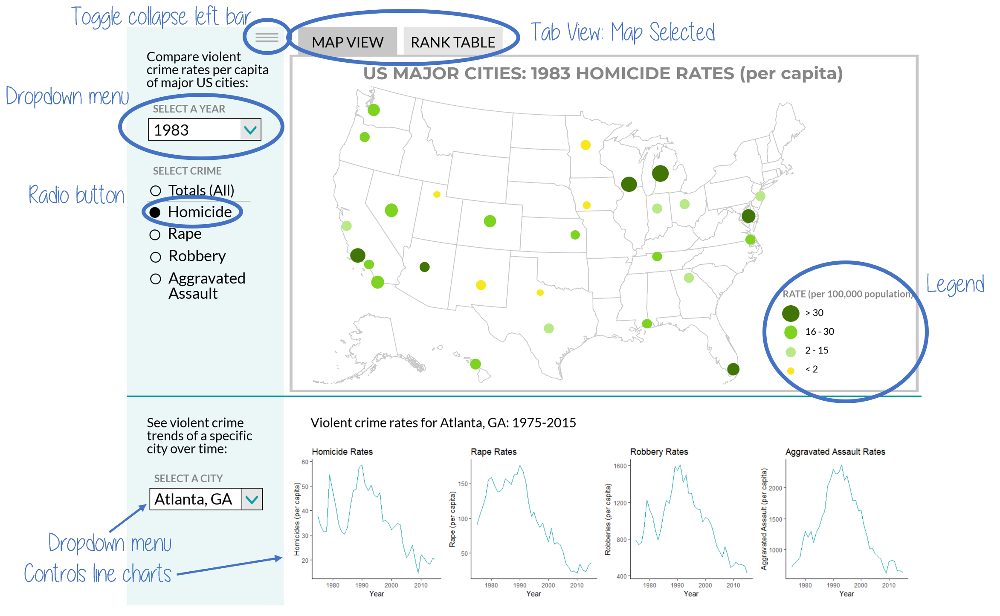
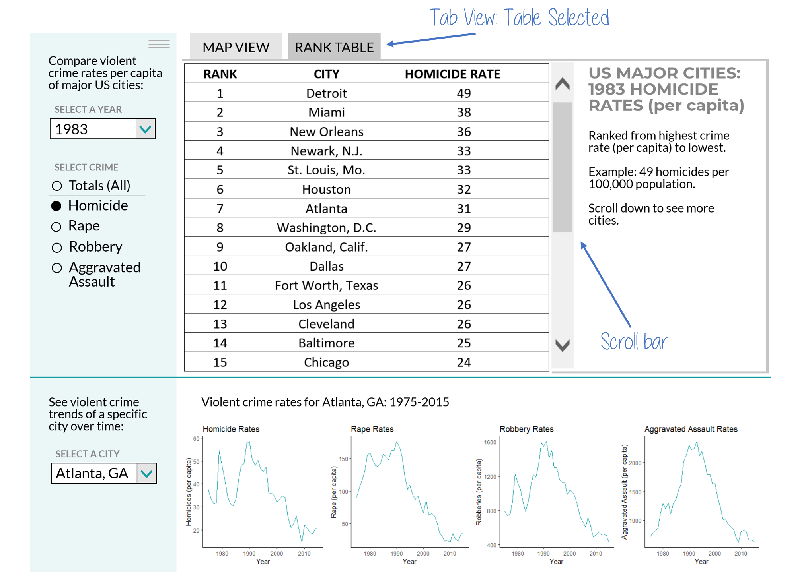

# Violent Crimes in the United States

Contributors: Alycia Butterworth ([alyciakb](https://github.com/alyciakb)), George J. J. Wu ([GeorgeJJW](https://github.com/GeorgeJJW))

## Overview

US government agencies typically do not publish crime data in a format that is readily accessible to the general public. To address this issue, we propose developing a free and open-source tool that can empower the public to visually explore crime incidents and trends in the cities they care about. Our project aims to display the geographical distribution of four types of violent crimes: homicide, rape, robbery, and aggravated assault across major US cities. We will also encourage users to explore crime trends, by allowing them to select a particular city and explore how crime rate for that city changes over time.

## Data

## Usage scenario

## App Description and Sketch

The landing page of the app will have a collapsible left bar that gives users the options to filter for the information they want to see and two tab view options: map view and rank table view. The map view will plot the variable rate per capita of each city, with both the size and darkness of the dot corresponding to the crime rate. A larger, darker dot represents a higher rate. The rank table view will list the cities in order from highest crime rate per capita to lowest. The data displayed will be the city name and the crime rate per capita (rounded to the nearest integer). In the left bar gives the user has the option to select from a dropdown menu a specific year between 1975 and 2015, or the average across all years. A radio button allows the user to select the crime type they wish to view: homicide, rape, robbery, aggravated assault, or all.

Below the map/table are four small line graphs that allow a user to learn more about a specific city. The line charts show the per capita crime rate across the years (1975-2015). There is one plot for each crime type: homicide, rape, robbery, and aggravated assault. The left bar has a dropdown menu that gives the option for the user to select a specific city or the average across all cities.

#### Sketch: Map View

#### Sketch: Table View

