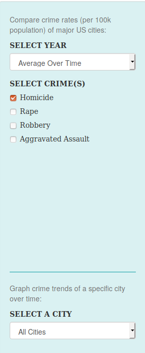
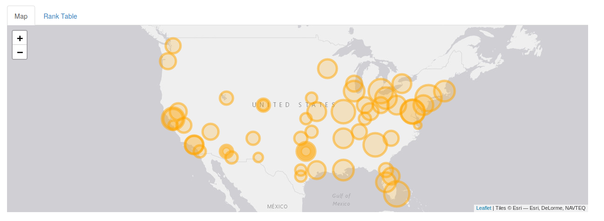
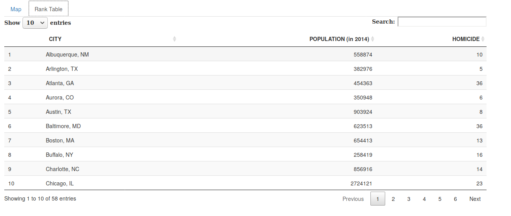

# Milestone 2 Writeup

Contributors: Alycia Butterworth ([alyciakb](https://github.com/alyciakb)), George J. J. Wu ([GeorgeJJW](https://github.com/GeorgeJJW))

## Screenshots and functionality

##### Side option panel

We implemented a slightly transparent sidebar panel. We rendered it with a teal background to distinguish it from the rest of the user interface. Note that this colour matches the colour of the lines in the time series plots for cohesion. The user should be able to select a single year to visualize the data on the map panel, as well as with the rank table. Below the year, the user can select one type or multiple types of crime to explore using the four check-boxes. If they select all four, the table will include the total violent crime rate (per capita), along with the four separate crime rates (per capita). After a large separation on the sidebar, we include an option for the user to select a particular city to generate time series plot with.

##### Map panel

The map panel displays the geographical distribution of crime incidents across major US cities. Users are encourage to pan, zoom, as well as drag and drop around the map panel to explore different patterns in the data. By hovering on top of the circular markers, users can get some more granular information about each city. The map panel will dynamically update its results, both when when users select a different year, as well as when users select a different type of crime. When multiple types of crime are selected, the map panel will adjust the size of the markers accordingly and display the sum total of all relevant crime incidents for each city at a given year.

##### Rank table panel

The rank table displays the cities in alphabetical order by default. As the user select a particular year, the table can display information population for the year chosen (or for the most recent year if “Average Over Time” is selected); the per capita crime rates of the crimes the user has selected. The user can reorder it by whichever column they would like by clicking the column name. The user can also use the search bar in the upper right of the table to search for a specific city or value.

##### Time series graphs

The four time series plots below the map and rank table panels can show the user how crime rates of a city has changed over time. The four plots will corresponding to four different violent crimes respectively. Users can potentially examine these four charts to not only see the contemporary crime rates for a city, but to also explore if the crime rates of a city were decreasing or increasing in a past time period.

## Rationale

We designed the user interface of our application around three main components - an interactive `map` panel, a `rank table` panel, as well as a plot section consisting of four `time series graphs`.

We want to give users the ability to see how crime incidents are geographically distributed across the United States via the `map` panel. We derived the longitude and latitude of each major US city and projected them onto a leafley map widget. We encoded cities with higher crime rates as bigger circle markers on the map tiles. We believed that using 2D surface area to encode crime rates can be more effective than simply using colour saturation. Users are encourage to navigate around the map, zoom in/out, and hover over each marker to get more detailed information about a city.

We also want users to be able to quickly rank or sort the US cities in terms of crime rates using the `rank table` panel. We implemented an interactive data table using the DT package, such that we could encode crime rates information simply as position on the rank table. Users can sort the table either in a ascending or descending order, allowing them to quickly compare the crime information of one US city to other cities. We chose to also include population as a variable in the table because all crime measures that we will be showing in the app are crime rates "per 100k population", not overall crime counts. By adding population, the user can, if they choose to, contemplate and estimate the overall crime counts as well. We chose not to include overall crime counts in our app because it may be misleading of the actual crime rates for those cities that simply have a larger population.

Furthermore, because much of our data is timestamped, we want to provide users with some `time series graphs`, so that they can explore how crime rates have been changed over time for a particular city. Depending on users' input, we dynamically generated time series graphs using the ggplot2 library. We encoded crime rates of a city for a specific year to be simply a position on a common scale. Users are encouraged to select a particular US city to populate the time series graphs.

To tie the above three components together, we want to also give users a side option panel so that they can select particular type of crime (using check-boxes), select a specific year (using a drop-down menu), or select a particular city to focus on (also using drop-down menu).  

## Tasks

To implement the design goals that we have set out for milestone 2, we completed the following tasks:

- Implement the `map` panel using leafley.
    - This also involved deriving the latitude and longitude of each major US cities.

- Implement the `rank table` panel using the DT package.

- Implement four `time series graphs` using the ggplot2 library.

- Implement a side option panel using check-boxes and drop-down menus.
    - This also involved routing the dynamic inputs of the users to an appropriate interface panel.

## Visions and upcoming steps

We have made some changes to our design goals since our [proposal](https://github.com/UBC-MDS/violent_crimes_usa/tree/v0.1) stage, as follows.

We determined that most of the data from the year 2015 is incomplete and problematic, we have adjusted the scope of our app to visualize data only from 1975 to 2014 instead.

We found it technically challenging to display all four time series graphs in a 1 x 4 grid below the map panel. By placing the graph one next to each other, we found it difficult to still make the labeling and axes of each graph easy to read. For this milestone, we simply arrange them into a 2 x 2 grid. We hope to further optimize the arrangement of these graphs in milestone 3.

We originally planned to encode the crime rate on the `map` panel using different colour saturations, while also providing a legend that bins different crime rates into a number of different colours. We've since decided that it is technically easier and more visually effective to simply encode crime rates using the area of the circular markers, as well as using on-hover tool-tips instead.

We originally planned to add an interactive title to the app. This title can remind the user of the year and the type of crimes that they have selected. This title can also serve to remind the user that the crime rate for each city is per "100k population". We found it unusually time-consuming to implement this interactive title properly. We might eventually implement this feature in a future milestone should time permits.

For the next milestone, we plan to put major efforts into polishing the user interface and improving the overall usability of our app. What we current have is an application that is somewhat functional, but by no means aesthetically appealing. We will try our best to make the following improvements to our app in the next milestone, as follows.

- Adjust the positioning of the time series chart to be more compact, but these graphs should still be legible.

- Make adjustments to the logic of the map panel so that it will not be redrawn or reset every time the user select a different year or crime type.

- Might be reasonable to set panning and zooming bounds to the map panel.

- Adjust the size of the map panel.

- Increase the font size and adjust the formatting of the on-hover tool-tip for each circular marker in the map panel.

- Implements on-hover tool-tips for the time series graphs.

- If time permits, we will also try to improve usability by implementing cross-panel selections. For instance, we envision that by clicking on a circular marker in the map panel, the user can also select a city to be plotted in the four time series graphs below.

## Known bugs and problems
- New York City is missing from the data set, its latitude and longitude needs to be retrieved and patched in.

- Some cities have overlapping circle markers in the map panel (e.g. Oakland and San Francisco).

- Unselecting all the check boxes will result in an error for the map panel. This issue will be addressed in milestone 3 (basically, we have to define a static map, then perform update to this static map via a map proxy instead; doing so will also solve the dynamic inputs resetting the entire map panel problem).

- This app currently is not responsive and will not be properly displayed on tablets and mobile devices.
